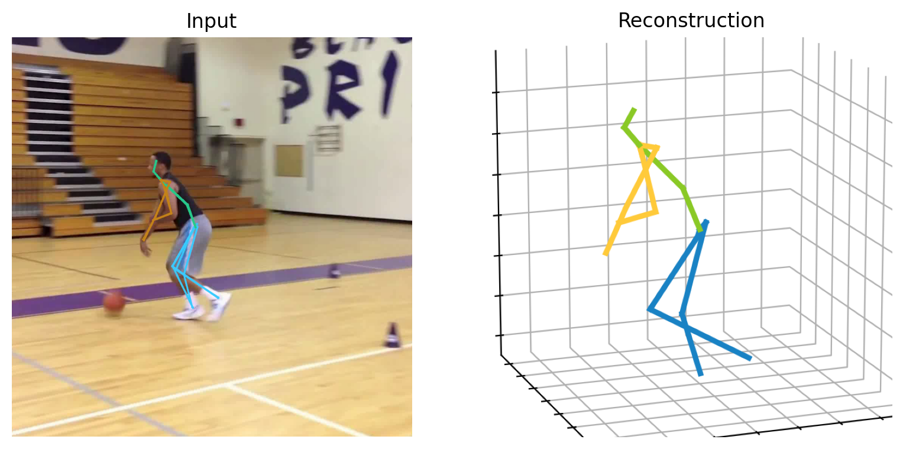
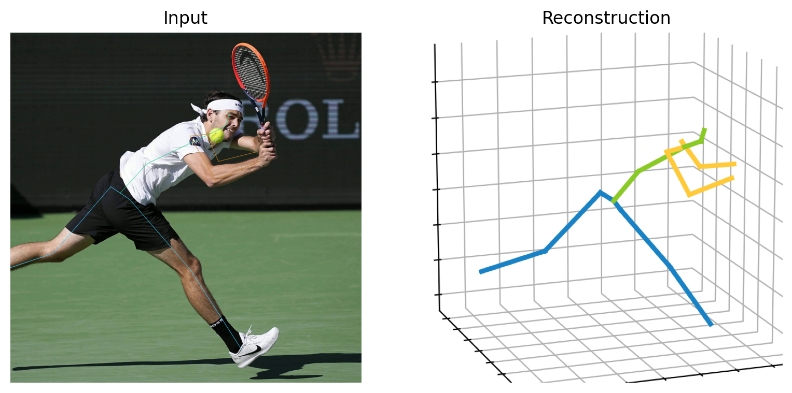
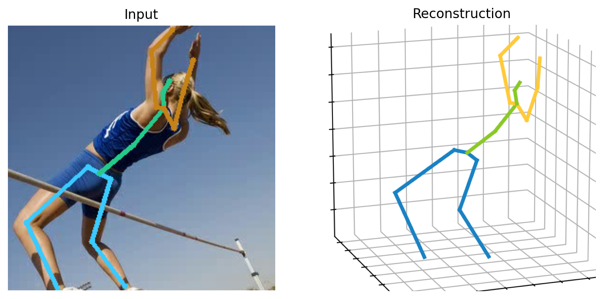
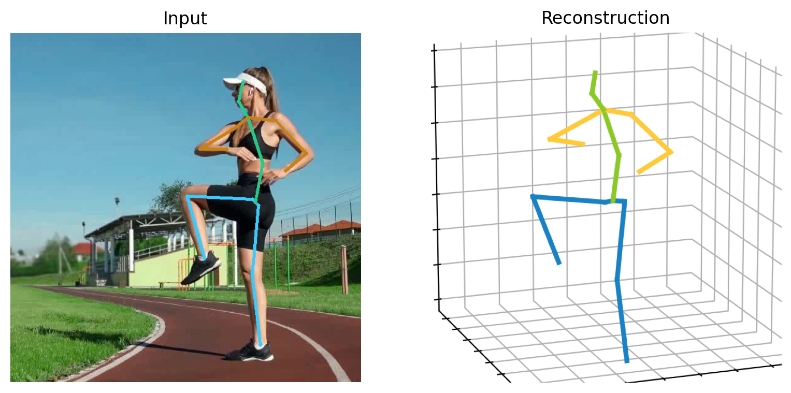

<h1 align="center">TGMF-Pose: Text-guided multi-view 3D pose estimation and fusion network for online sports instruction</h1>


## 1. Installation

TGMF-Pose is tested on Ubuntu 20.04 with Pytorch 2.0.1 and Python 3.9. 
- Create a conda environment: ```conda create -n hot python=3.9```
- Install PyTorch 2.0.1 following the [official instructions](https://pytorch.org/)

```bash
    pip3 install -r requirements.txt 
```

## 2. Dataset setup

Please download the dataset from [Human3.6M](http://vision.imar.ro/human3.6m/) website, and refer to [VideoPose3D](https://github.com/facebookresearch/VideoPose3D) to set up the Human3.6M dataset ('./dataset' directory).

```bash
${POSE_ROOT}/
|-- dataset
|   |-- data_3d_h36m.npz
|   |-- data_2d_h36m_gt.npz
|   |-- data_2d_h36m_cpn_ft_h36m_dbb.npz
```
Download [MPI-INF-3DHP](https://vcai.mpi-inf.mpg.de/3dhp-dataset/) dataset for model evaluation.


## 3. Train the model
```bash
    python3 train.py
```

## 4. Test the model
```bash
    python3 test.py --batch_size 4 --test --frames 243 --stride 243 --model <MODEL_PATH>
```


## 5. Visualization
First, you need to download YOLOv3 and HRNet pretrained models [here](https://drive.google.com/drive/folders/1_ENAMOsPM7FXmdYRbkwbFHgzQq_B_NQA?usp=sharing) and put it in the './demo/lib/checkpoint' directory. 
Then, you need to put your in-the-wild videos in the './demo/video' directory. 

Run the command below:
```bash
    python demo/vis.py --video sample_video.mp4
```

Sample demo output:

<p align="center" style="display: flex; justify-content: space-around">
    
    
</p>

<p align="center" style="display: flex; justify-content: space-around">
    
    
</p>

## 6. AI teacher System
### Quickstart

Get started with Transformers right away with the Pipeline API. The `Pipeline` is a high-level inference class that supports text, audio, vision, and multimodal tasks. It handles preprocessing the input and returns the appropriate output.

Instantiate a pipeline and specify model to use for text generation. The model is downloaded and cached so you can easily reuse it again. Finally, pass some text to prompt the model.

```py
from transformers import pipeline

pipeline = pipeline(task="Visual QA", model="ViT-B/32")
pipeline("<image data>", "<posture data>", "A boy is doing sit ups.")
[{'generated_text': 'The sit-up is incomplete as the trunk elevation is insufficient, likely due to poor core engagement. You should aim to flex your torso at least 30 degrees to activate the core. Engage your abdominal muscles more, and focus on maintaining a neutral spine throughout. Ensure a smooth movement without jerking. Safety Notes: Keep your neck relaxed and avoid excessive forward bending to protect your cervical spine.'}]
```

To chat with a model, the usage pattern is the same. The only difference is you need to construct a chat history (the input to `Pipeline`) between you and the system.

```py
import torch
from transformers import pipeline

chat = [
    {"role": "system", "content": "You are a professional physical education teacher who will correct students' movement posture."},
    {"role": "user", "posture data": "..."},
    {"role": "user", "content": "A boy is doing sit ups, Can you tell me if his movements are standard and provide advice?"}
]

pipeline = pipeline(task="text-generation", model="ViT-B/32", torch_dtype=torch.bfloat16, device_map="auto")
response = pipeline(chat, max_new_tokens=512)
print(response[0]["generated_text"][-1]["content"])
```
